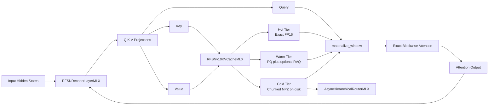

# RFSN v10.2 on Apple Silicon

[](README.md)
[](README.md)
[](README.md)
[](README.md)
[](README.md)

RFSN v10.2 is an Apple Silicon focused research scaffold for experimenting with a tiered KV cache, product quantization, sparse residual refinement, and exact blockwise attention over a partially reconstructed context window.

The repo is designed to answer a practical question:

Can a hot and warm and cold cache design reduce memory footprint enough to matter on Apple hardware without hiding the real latency and drift costs of reconstruction?

The current implementation is intentionally honest about those tradeoffs. It runs, it benchmarks, it records what it reconstructs per call, and it exposes where compression helps memory but still hurts latency.

## Quick Links

- [What This Repo Is](#what-this-repo-is)
- [Current Status](#current-status)
- [Architecture](#architecture)
- [Repository Layout](#repository-layout)
- [Getting Started](#getting-started)
- [Run Commands](#run-commands)
- [Benchmark Outputs](#benchmark-outputs)
- [Design Notes](#design-notes)
- [Limitations](#limitations)

## What This Repo Is

- An MLX native prototype for Apple Silicon.
- A tiered KV cache with exact hot storage, compressed warm storage, and disk backed cold storage.
- A research harness for comparing dense attention against compressed cache access paths.
- A decoder layer API that integrates projections, cache updates, and cache backed decode.
- A unified launcher that prefers MLX and falls back to PyTorch MPS or CPU.

## What This Repo Is Not

- Not a production serving backend.
- Not an ANE specific deployment stack.
- Not a full model implementation with training or checkpoint loading.
- Not yet optimized enough to claim end to end latency wins for the compressed path.

## Current Status

The project is in a useful state for systems research and benchmark-driven iteration.

What is working now:

- MLX first runtime path with a passing test suite.
- Unified Mac launcher with MLX, PyTorch MPS, and PyTorch CPU backend selection.
- Product quantization plus sparse residual vector quantization.
- Tiered cache reads that only reconstruct the overlapping warm and cold chunks for the requested window.
- Per call cache instrumentation including reconstructed token counts, warm chunk decodes, cold chunk decodes, and cold prefetch hit and miss counters.
- Evaluation sweeps across context windows, storage profiles, and quantizer modes.

What the latest measurements show:

- Memory compression is real and measurable.
- RVQ reduces drift relative to PQ only.
- Reconstruction still adds latency, especially when RVQ is active.
- Router aligned cold prefetch now produces real hits in the cold mixed benchmark path.

## Architecture



### Core Ideas

1. Keep the most recent context exact in the hot tier.
2. Compress the middle band into a warm tier using PQ and optional RVQ.
3. Spill older context to disk in block sized cold chunks.
4. Reconstruct only the portion of the window actually touched by the current attention call.
5. Measure the reconstruction cost directly instead of inferring it from total sequence length.

## Repository Layout

| File | Purpose |
| --- | --- |
| [rfsn_v10_mlx_ane_complete.py](rfsn_v10_mlx_ane_complete.py) | Public MLX entrypoint, tests, benchmarks, decoder layer API |
| [rfsn_v10_unified_mac_launcher.py](rfsn_v10_unified_mac_launcher.py) | Backend detection and launcher for MLX, MPS, and CPU |
| [rfsn_v10_eval_benchmark.py](rfsn_v10_eval_benchmark.py) | Dense versus tiered cache evaluation sweep |
| [cache.py](cache.py) | Tiered KV cache, window materialization, cold chunk access instrumentation |
| [quantization.py](quantization.py) | PQ and RVQ encode and decode logic plus compressed tensor helpers |
| [attention.py](attention.py) | Exact blockwise attention and compressed store attention wrapper |
| [storage.py](storage.py) | Shared config, chunk IO helpers, compressed tensor containers, async router |
| [requirements.txt](requirements.txt) | Pinned versions used to validate this repo |
| [benchmark_outputs](benchmark_outputs) | Generated CSV benchmark artifacts |

## Getting Started

### Prerequisites

- macOS on Apple Silicon
- Python 3.9 or newer
- A working compiler toolchain suitable for Python packages on macOS

Validated package versions in this repo:

- mlx 0.29.3
- torch 2.8.0
- numpy 2.0.2

### Installation

```bash
python3 -m venv .venv
source .venv/bin/activate
python3 -m pip install --upgrade pip
python3 -m pip install -r requirements.txt
```

If you prefer pyenv, the repo has already been validated with Python 3.9.7 on Apple Silicon.

## Run Commands

### 1. Run the MLX test suite

```bash
python3 rfsn_v10_mlx_ane_complete.py --test
```

This exercises:

- PQ and RVQ round trips
- Quantized codebook fast path
- Exact versus reconstructed attention parity checks
- Tiered cache read correctness
- Warm window materialization
- Router assisted cold chunk hits
- Decoder layer cache backed decode

### 2. Run the MLX benchmark harness

```bash
python3 rfsn_v10_mlx_ane_complete.py --bench
```

This prints scenario level stats for:

- hot_only
- warm_mixed
- cold_mixed

Each benchmark now reports reconstruction work directly, including reconstructed tokens and warm and cold decode counts.

### 3. Use the unified launcher

```bash
python3 rfsn_v10_unified_mac_launcher.py
python3 rfsn_v10_unified_mac_launcher.py --backend mlx --bench
python3 rfsn_v10_unified_mac_launcher.py --backend mps
python3 rfsn_v10_unified_mac_launcher.py --backend cpu
```

Backend priority:

1. MLX on Apple Silicon
2. PyTorch with MPS
3. PyTorch on CPU

### 4. Run the evaluation sweep

```bash
python3 rfsn_v10_eval_benchmark.py
```

The default sweep evaluates:

- sequence lengths 32, 64, 128, 192
- requested windows 32, 64, 128, full prefix
- storage profiles hot_warm and cold_mixed
- quantizer modes pq_only and pq_rvq

### 5. Run a cold router focused sweep

```bash
python3 rfsn_v10_eval_benchmark.py \
  --lengths 128 \
  --context-windows 64 \
  --repeats 2 \
  --use-router-for-cold \
  --output benchmark_outputs/dense_vs_hot_warm_router.csv
```

## Benchmark Outputs

Generated CSV artifacts live in [benchmark_outputs](benchmark_outputs).

Important files:

- [benchmark_outputs/dense_vs_hot_warm.csv](benchmark_outputs/dense_vs_hot_warm.csv)
- [benchmark_outputs/dense_vs_hot_warm_router.csv](benchmark_outputs/dense_vs_hot_warm_router.csv)

### What The Columns Mean

The evaluation CSV includes both behavioral and systems metrics:

- sequence_length: total synthetic context length
- storage_profile: hot_warm or cold_mixed
- requested_context_window: requested attention window, where 0 means full prefix
- window_tokens: effective window after clipping to actual sequence length
- quantizer_mode: pq_only or pq_rvq
- cache_latency_ms: measured cache path latency
- output_rmse and score_rmse: drift relative to dense exact attention
- reconstructed_tokens: how many tokens had to be decoded from warm or cold storage
- warm_chunk_decodes and cold_chunk_decodes: how many chunk decode operations were performed
- cold_chunk_cache_hits and cold_chunk_cache_misses: whether router assisted prefetch actually helped

### Current Read On The Results

Representative current results from the checked in CSVs:

- At sequence length 64 with a 64 token hot_warm window, PQ only shows about 1.94x memory compression while PQ plus RVQ lowers output RMSE relative to PQ only.
- At longer windows, RVQ usually reduces drift but increases latency substantially because it reconstructs more information per decoded chunk.
- In the router focused cold mixed run at length 128 and requested window 64, the cold path now records two cold chunk cache hits and zero misses, which confirms the router is aligned with the current chunk layout.

The takeaway is still the same: memory wins are real, drift can be reduced with RVQ, and latency remains the main systems bottleneck.

## Python API Example

```python
import mlx.core as mx

from rfsn_v10_mlx_ane_complete import RFSNConfig, RFSNDecoderLayerMLX

config = RFSNConfig(
    hidden_dim=512,
    num_heads=4,
    head_dim=128,
    num_layers=2,
    hot_capacity=32,
    warm_capacity=96,
    cold_capacity=128,
    block_size_seq=16,
)

layer = RFSNDecoderLayerMLX(config)

prompt = mx.random.normal(shape=(1, 16, config.hidden_dim), dtype=mx.float32).astype(mx.float16)
layer.prefill_cache(prompt)

next_token = mx.random.normal(shape=(1, 1, config.hidden_dim), dtype=mx.float32).astype(mx.float16)
decoded = layer(next_token, use_cache=True, context_window=64)
print(decoded.shape)
```

## Design Notes

### Quantization Strategy

- PQ splits each head vector into subspaces.
- Each subspace is quantized independently.
- RVQ optionally refines the residual for vectors whose residual norm exceeds a sparsity threshold.
- PQ and RVQ codebooks can optionally use MLX quantize and dequantize fast paths when the group size constraints are compatible.

### Attention Strategy

- Attention is computed exactly over the reconstructed window using blockwise online softmax.
- There is no approximate attention kernel in the final step.
- Approximation enters through compression and reconstruction, not through the attention reduction itself.

### Cache Strategy

- Hot tier stores exact FP16 tensors in memory.
- Warm tier stores compressed tensors in memory.
- Cold tier stores compressed block sized chunks on disk.
- materialize_window reconstructs only the overlapping portions of hot, warm, and cold for the requested window.

### Router Strategy

- The router predicts chunk IDs from the active token position and context window.
- Cold spill is block aligned so chunk IDs now match the router's search space.
- The evaluation harness exposes hit and miss counters so router effectiveness is measurable rather than assumed.

## Limitations

- The repository does not load or serve a real frontier model checkpoint.
- The decoder layer API is a synthetic but useful systems wrapper, not a drop in replacement for a complete transformer stack.
- Current latency numbers are dominated by reconstruction cost once the compressed path is engaged.
- The benchmark harness is synthetic and not tied to any one production prompt distribution.
- The cold router is now functionally aligned, but its prediction strategy is still simple and can be improved.

## Roadmap Ideas

- Stronger router policies based on actual chunk metadata and access history.
- Better warm tier scheduling to reduce decode fanout for wide windows.
- Smarter RVQ gating so drift reduction is concentrated where it matters most.
- More realistic workload traces and prompt distributions.
- Integration with a real model block stack and checkpoint adapters.

## Reproducibility Notes

- Use [requirements.txt](requirements.txt) for package pinning.
- Regenerate benchmark artifacts locally before comparing runs across machines.
- Treat the CSVs as experiment outputs, not fixed performance claims.

## License

No license file is currently included in this repository. Add one before external distribution if needed.
